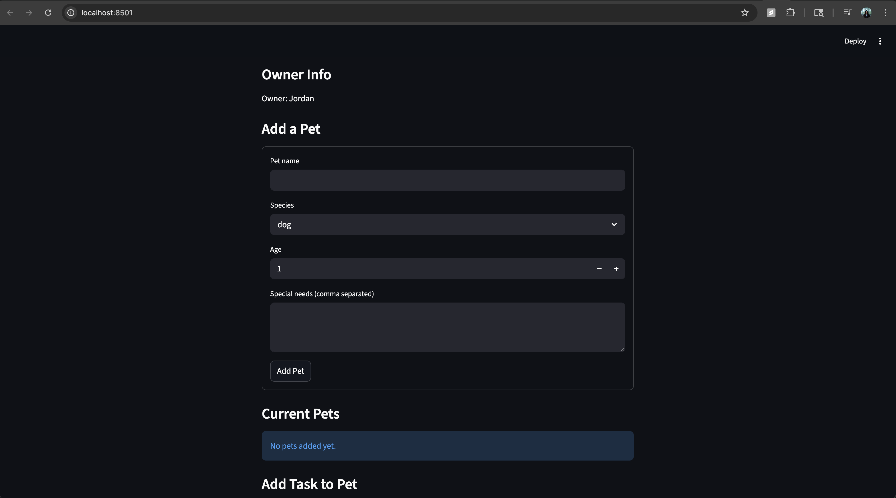
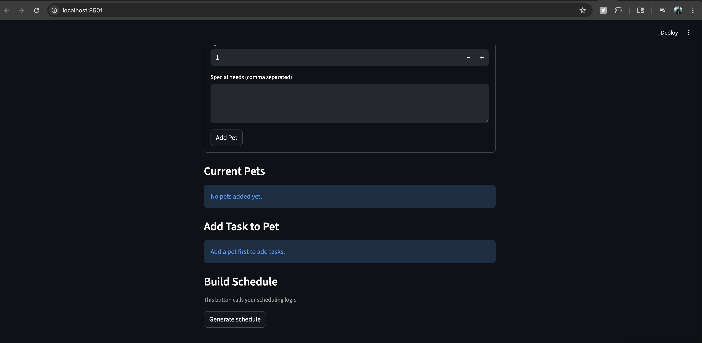

# PawPal+ (Module 2 Project)

You are building **PawPal+**, a Streamlit app that helps a pet owner plan care tasks for their pet.

## Scenario

A busy pet owner needs help staying consistent with pet care. They want an assistant that can:

- Track pet care tasks (walks, feeding, meds, enrichment, grooming, etc.)
- Consider constraints (time available, priority, owner preferences)
- Produce a daily plan and explain why it chose that plan

Your job is to design the system first (UML), then implement the logic in Python, then connect it to the Streamlit UI.

## What you will build

Your final app should:

- Let a user enter basic owner + pet info
- Let a user add/edit tasks (duration + priority at minimum)
- Generate a daily schedule/plan based on constraints and priorities
- Display the plan clearly (and ideally explain the reasoning)
- Include tests for the most important scheduling behaviors

## Features

- **Sorting by time**: Tasks are sorted chronologically by preferred time slot — morning maps to 06:00, afternoon to 12:00, evening to 18:00 — using `datetime.strptime` for accurate ordering.
- **Filtering by pet or status**: Tasks can be filtered by pet name and/or completion status, allowing the UI to show only incomplete items or tasks for a specific pet.
- **Priority-aware scheduling**: `prioritize_tasks` ranks eligible tasks by a composite score: time-slot fit (whether the task matches an available owner slot), numeric priority (high=3, medium=2, low=1) plus a bonus for senior or special-needs pets, and shorter duration as a tiebreaker.
- **Daily and weekly recurrence**: When a task is marked complete, `complete_task` automatically creates a new instance due the next day (daily) or in 7 days (weekly) using `timedelta`, so recurring care is never dropped.
- **Conflict warnings**: `detect_conflicts` checks for overlapping time intervals both within a single pet's tasks and across different pets, surfacing warning messages without crashing the scheduler.
- **Available-time cap**: `generate_schedule` enforces the owner's `available_time_per_day` budget, skipping tasks that would exceed the daily limit and adding a warning for each skipped task.
- **Pet care categorization**: `get_care_category` classifies each pet (puppy, adult dog, senior dog, kitten, adult cat, senior cat, other) based on species and age, and the priority scorer awards bonus points to senior pets and those with special needs.

## Demo





## Getting started

### Setup

```bash
python -m venv .venv
source .venv/bin/activate  # Windows: .venv\Scripts\activate
pip install -r requirements.txt
```

### Testing PawPal+

- Run tests using the command
  `python -m pytest tests/test_pawpal.py -v`
- Confidence level: 4-5 out 5

### Suggested workflow

1. Read the scenario carefully and identify requirements and edge cases.
2. Draft a UML diagram (classes, attributes, methods, relationships).
3. Convert UML into Python class stubs (no logic yet).
4. Implement scheduling logic in small increments.
5. Add tests to verify key behaviors.
6. Connect your logic to the Streamlit UI in `app.py`.
7. Refine UML so it matches what you actually built.
